# Efficient Inference Benchmarking (Flux.2)

This repository contains the efficient inference part of the CSC_5IA21 project:
https://giannifranchi.github.io/CSC_5IA21.html

The code benchmarks FLUX.2 variants under constrained hardware, with emphasis on quantization, offloading, monitoring, and OCR-aware quality evaluation.

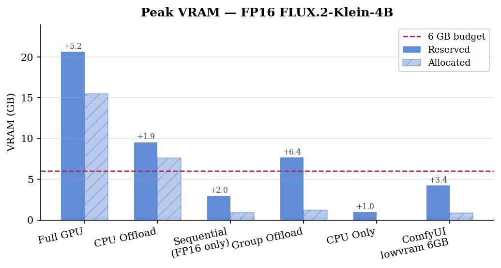
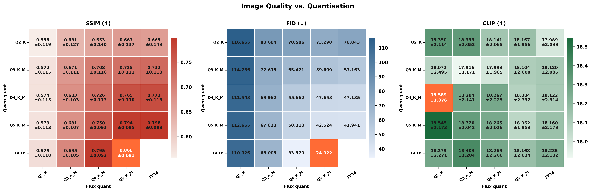
## Project Scope

- Focus: inference efficiency only (not full training/fine-tuning).
- Main question: what setup is best for frugal hardware (low VRAM/RAM).
- Comparison axis: latency, memory, system load, and output quality.

## Models and Strategies

Benchmarked model family:
- FLUX.2-Klein FP16 baseline.
- GGUF quantized variants: Q2_K, Q3_K_M, Q4_K_M, Q5_K_M.

Benchmarked execution strategies:
- Full GPU.
- CPU offload / sequential / group offload.
- CPU-only baseline.
- Custom smart offloading.
- ComfyUI low-VRAM path.

## What We Track

- Latency: load, encode, generate, total.
- Memory: VRAM reserved/allocated, RAM RSS.
- Transfers: PCIe TX/RX.
- Utilization and energy: GPU/CPU usage, power, energy per image.
- Text/quality metrics: OCR (CER, normalized CER, WER), SSIM, FID, CLIP.

## Repository Structure

```text
efficient_image_generation/
  src/
    models/        # model descriptors/loaders
    offload/       # smart offloading + pipeline patches
    monitoring/    # runtime monitor + metrics aggregation
    evaluation/    # OCR, SSIM, FID, CLIP modules
  benchmark_offload.py        # hardware/offloading benchmark orchestration
  benchmark_models.py         # prompt/seed/model image generation benchmark
  comfy_benchmark.py          # ComfyUI low-VRAM benchmark path
  evaluate_ocr.py             # OCR evaluation pipeline
  evaluate_ssim_clip_fid.py   # SSIM/FID/CLIP evaluation pipeline
  report_figures.py           # report figure generation
  figures/                    # benchmark and qualitative figures
  results/                    # generated images and CSV outputs
```

## Core Scripts and Code Paths

### 1) Hardware + offloading benchmark

Main orchestration: `benchmark_offload.py`

- Runs full lifecycle phases per run: load -> encode cold -> gen cold -> encode warm -> gen warm -> cleanup.
- Saves per-run traces and aggregated summaries.

Example:

```bash
python benchmark_offload.py
```

### 2) Smart offloading implementation

Main source: `src/offload/offload.py`

- `SmartOffloadManager` classifies modules into resident vs streaming according to VRAM budget.
- Uses pinned CPU memory + CUDA streams + hook-based tensor swapping.
- Includes GGUF-specific dequant ring-buffer logic.

Minimal usage pattern:

```python
from src.offload.offload import SmartOffloadManager

mgr = SmartOffloadManager(transformer, max_vram_gb=6.0, device="cuda", num_streams=2)
mgr.load()
# run inference
mgr.unload()
```

### 3) Monitoring implementation

Main sources:
- `src/monitoring/resource_monitor.py`
- `src/monitoring/metrics.py`

Sampling backend combines:
- `psutil` for process CPU/RAM,
- `pynvml` for GPU utilization/power/PCIe,
- torch CUDA allocator stats for allocated/reserved VRAM.

Minimal usage pattern:

```python
from src.monitoring import ResourceMonitor

with ResourceMonitor(sample_rate_hz=5.0) as mon:
    # run generation
    pass

metrics = mon.get_metrics()
df = metrics.to_dataframe()
print(metrics.vram_reserved_max_mb, metrics.ram_max_mb)
```

### 4) OCR and quality evaluation

Main sources:
- `src/evaluation/ocr.py` and `evaluate_ocr.py`
- `src/evaluation/ssim.py`
- `src/evaluation/fid.py`
- `src/evaluation/clip_score.py`
- `evaluate_ssim_clip_fid.py`

OCR backends in code:
- EasyOCR.
- GLM-OCR (`zai-org/GLM-OCR`).

Example OCR run:

```bash
python evaluate_ocr.py
```

Example SSIM/FID/CLIP run:

```bash
python evaluate_ssim_clip_fid.py
```

### 5) INT8 Quantization with Optimum-Quanto

Main script: `quant_fp2_klein.py`

This script provides a focused benchmarking path for the `FLUX.2-klein-4B` model, comparing the FP16 baseline against an INT8 quantized variant using Hugging Face's `optimum-quanto`. To avoid out-of-memory (OOM) errors on constrained hardware, the script applies `qint8` quantization and freezes the weights directly on the CPU RAM before moving the model to the GPU. 

It evaluates text-heavy prompts and outputs a comparative graph of:
- Peak VRAM usage
- System RAM usage
- Inference Latency
- Image Quality (CLIP Score)

Example run:

```bash
python quant_fp2_klein.py
```

## Benchmark Overview Figures

### Hardware monitoring pipeline
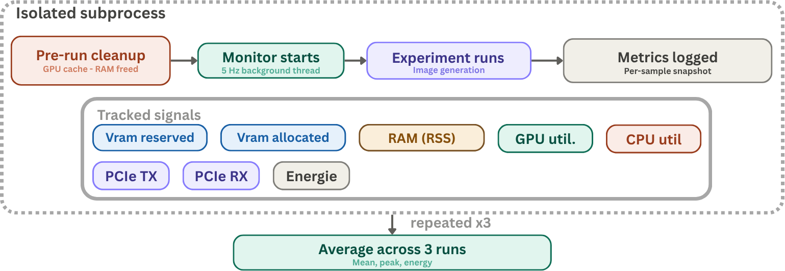

### OCR and evaluation pipeline
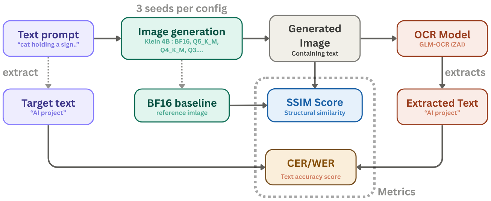

## Benchmark Figures (Offloading + Hardware)


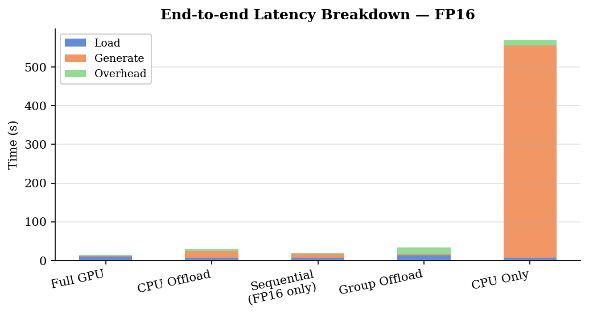
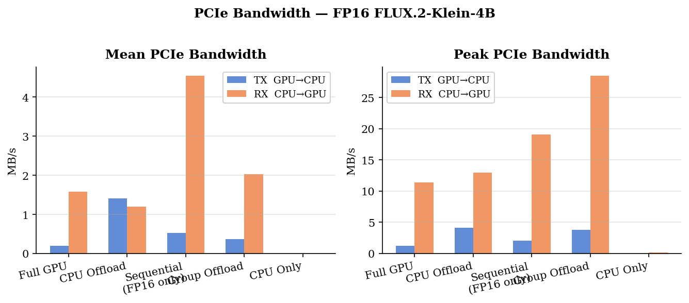
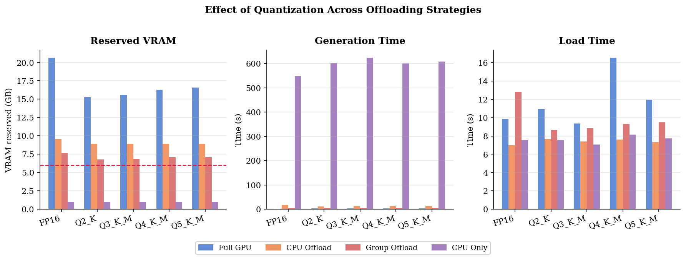
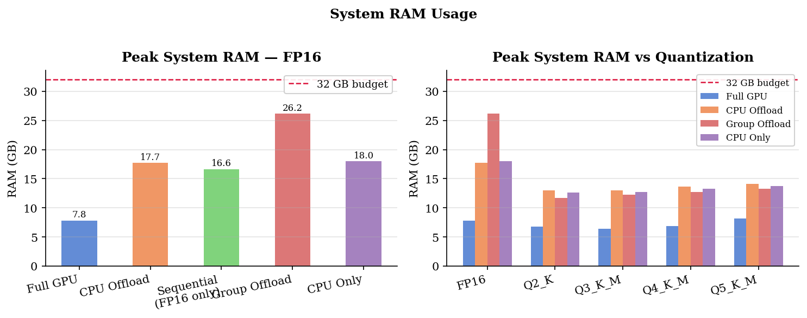
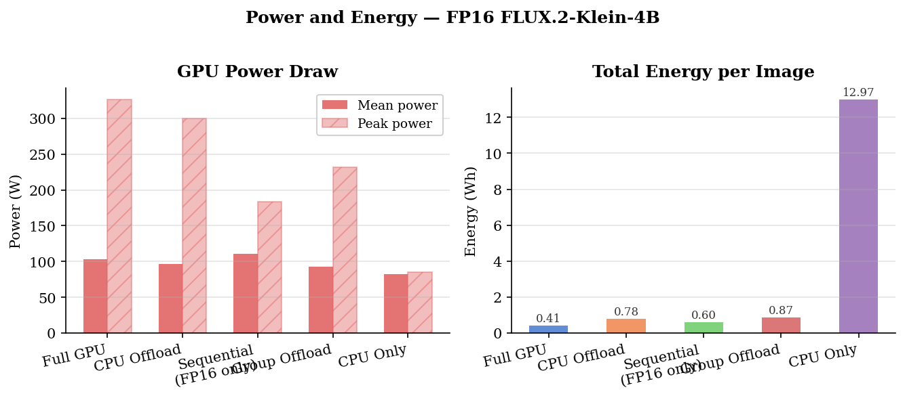
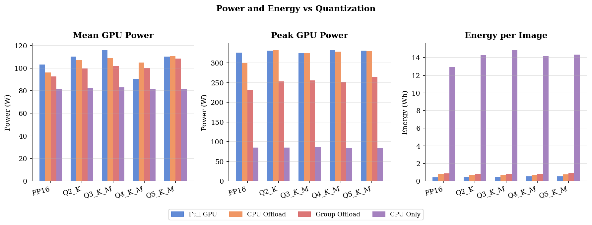
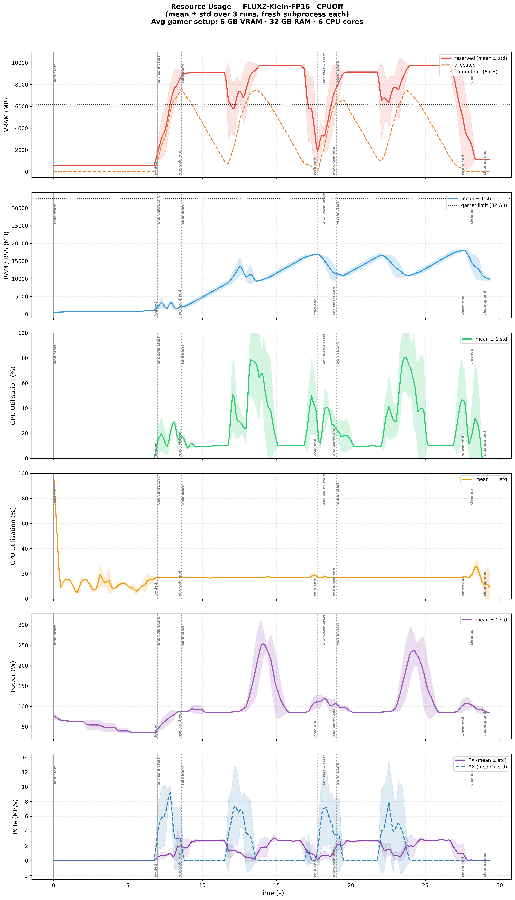

## Qualitative and Quality Figures

<summary>Show qualitative and quality report figures</summary>


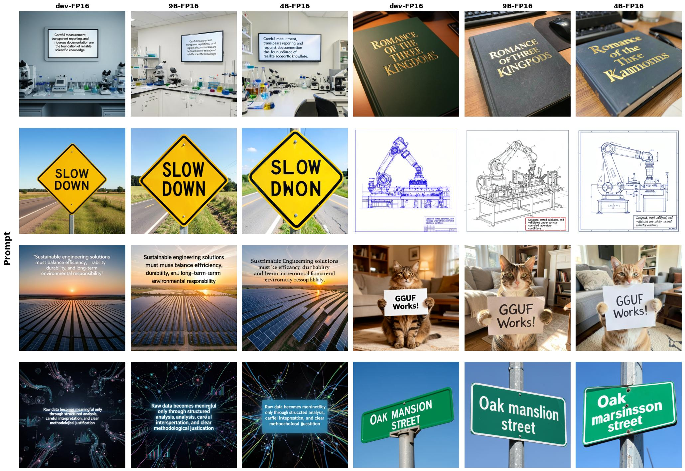
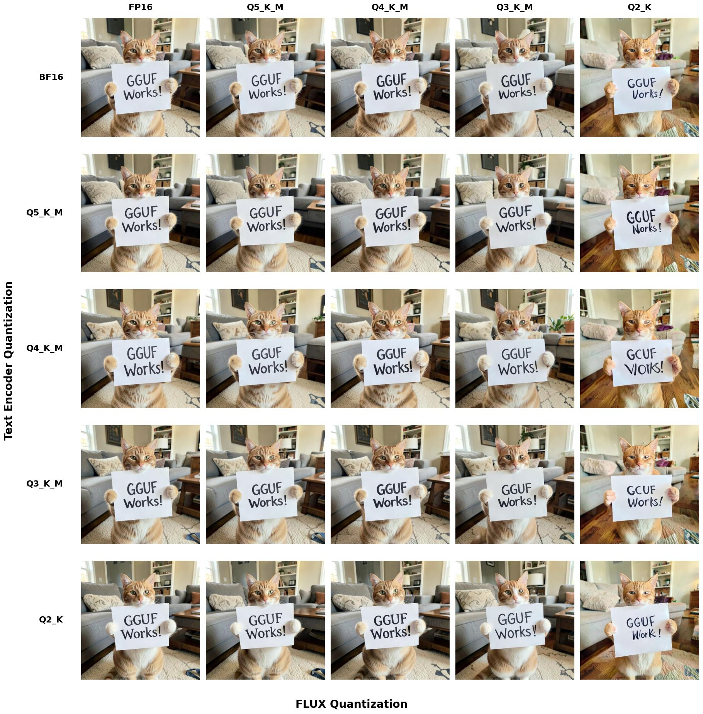
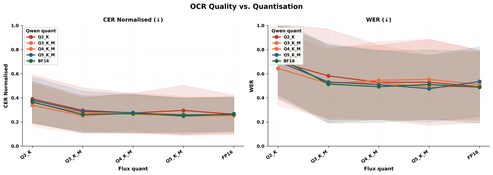


