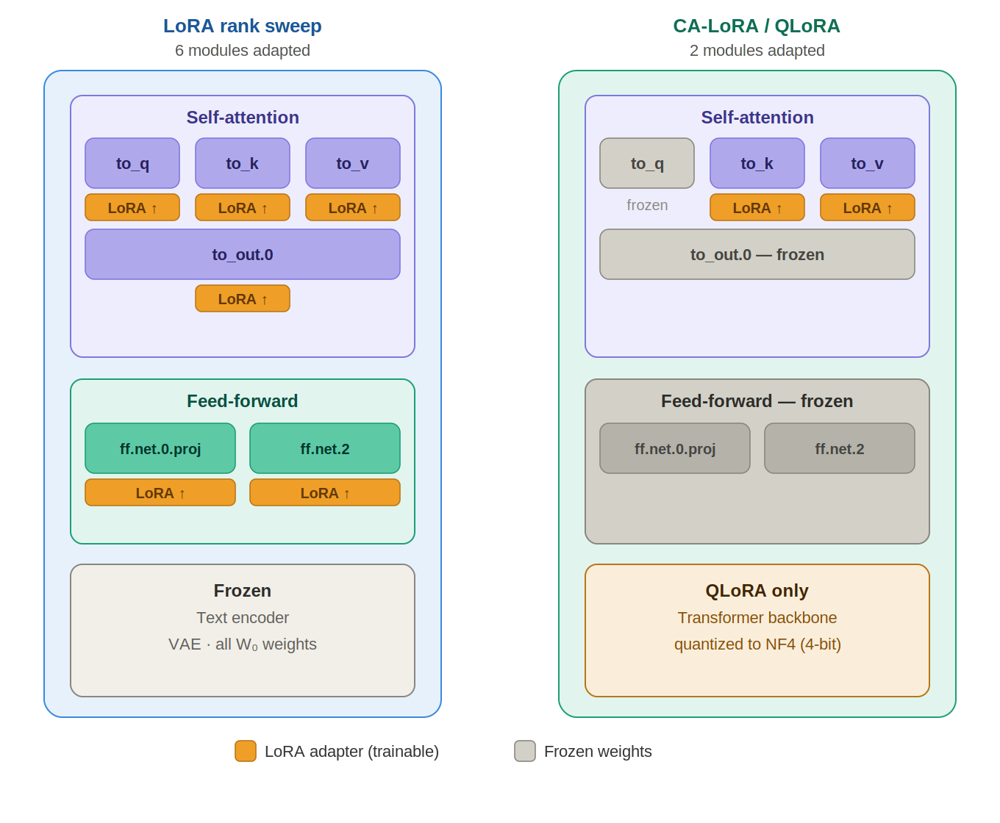
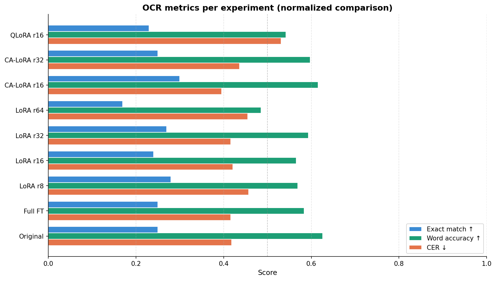
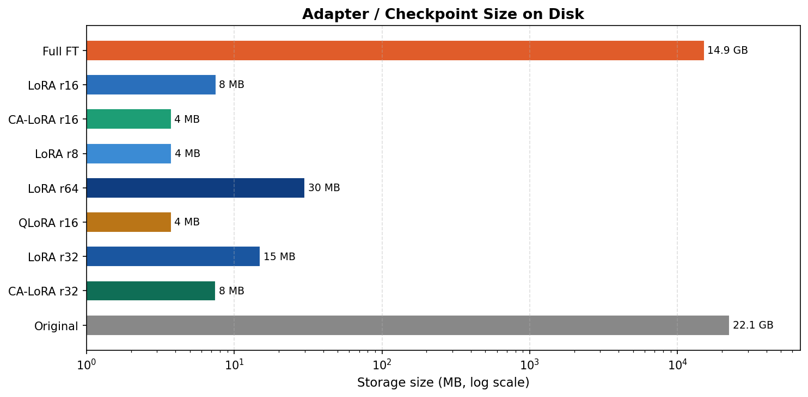
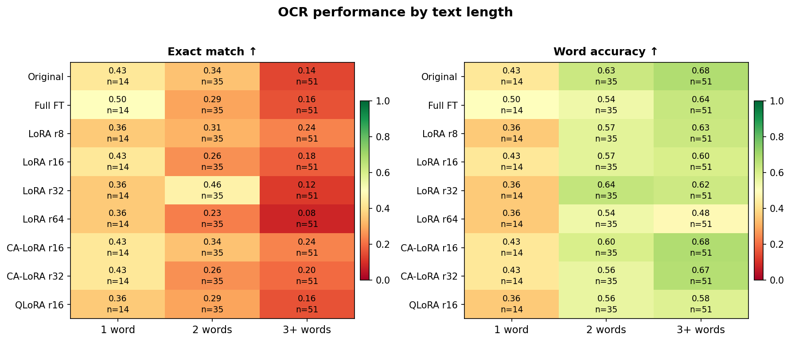

# Efficient Training : Fine Tuning Startegies Applied for Efficient Image Generation with Text Rendering

---

## Our Approach

Instead of retraining the entire model, we explored **LoRA** (Low-Rank Adaptation) — a technique that adds tiny trainable "patches" on top of a frozen model instead of training all Transformer's parameters.

We tested four strategies on the **Flux.2 Klein 4B** model:

| Strategy | What it does | Trainable params |
|---|---|---|
| Full fine-tuning | Updates all 4 billion parameters | 100% |
| LoRA rank sweep | Adds adapters to attention + feed-forward layers | ~0.5% |
| **CA-LoRA** | Adds adapters only to cross-attention layers | **~0.04%** |
| QLoRA | Same as CA-LoRA, but the model is also compressed to 4-bit | ~0.04% |

We specifically focused on **cross-attention layers** — the part of the model that "reads" the text prompt and decides how to render it in the image. Our hypothesis: if text rendering fails, it's because the model isn't paying attention to the right parts of the prompt.



---

## The Dataset

We built a custom dataset of **1,000 images** sourced from AnyWord-3M,
constructed using the pipeline in [`Dataset_creation/`](../Dataset_creation).
It applies a strict 6-stage filter (OCR verification, image quality checks,
automatic captioning). Each sample contains an image, the exact text visible
in it, and a training prompt.

Only ~5% of candidate images passed all filters — ensuring high quality over quantity.

---

## Main Finding: 

**CA-LoRA with rank 16 is the best model** — not the most powerful one, but the most targeted one.



With only **4 MB of adapter weights** (versus 15 GB for full fine-tuning), CA-LoRA r=16 achieves:
- The best **Exact Match** score: 0.30 (+20% vs full fine-tuning)
- The best **Character Error Rate**: 0.40 (lower is better)

> Throwing more parameters at the problem makes things **worse** — higher-rank LoRA adapters overfit to scene appearance and forget about the characters.

---

## The Storage Cost: 4000× Smaller



All LoRA adapters fit between 4 and 30 MB. The full fine-tune checkpoint weighs **15 GB**. This means you can share, store, and swap fine-tuned behaviors for almost no cost.

---

## Where It Still Struggles



All models — including ours — collapse on **3+ word targets**. Exact match drops to near zero when the text is longer than two words. This is the main open challenge: models can render individual words but fail to maintain consistency across a full phrase.

---

## How to Run It

### Install

```bash
git clone <repo_url>
cd Projet-IA-Efficient-Image-Generation/Efficient_training

python3 -m venv venv
source venv/bin/activate

pip install -U git+https://github.com/huggingface/diffusers.git
pip install -r requirements.txt
```

> Flux.2 Klein requires the **development version** of `diffusers` — the PyPI release does not include `Flux2KleinPipeline`.

### Download the model

```bash
export HF_TOKEN="your_huggingface_token"
python download_model.py
```

Accept the license on [HuggingFace](https://huggingface.co/black-forest-labs/FLUX.2-klein-base-4B) first (~8 GB download).

### Train

```bash
python train_lora_cross_attention.py   # recommended: CA-LoRA r=16
python train_lora_rank_sweep.py        # LoRA r=8, 16, 32, 64
python train_qlora.py                  # QLoRA (lowest VRAM)
python train_full_finetune.py          # full fine-tuning (upper bound)
```

### Evaluate and plot

```bash
python evaluate_all.py          # FID, CLIP, OCR metrics on test set
python analyze_ocr_by_length.py # OCR breakdown by word count (no GPU needed)
python generate_plots.py        # all result figures
```

### On a SLURM cluster

```bash
sbatch jobs/sh_files/job_lora_cross_attention.sh
sbatch jobs/sh_files/job_evaluate_all.sh
```

---

## Project Structure

```
Efficient_training/
├── train_*.py               # Training scripts (one per strategy)
├── evaluate_all.py          # Evaluation pipeline
├── analyze_ocr_by_length.py
├── generate_plots.py
├── src/
│   ├── evaluation/fid.py
│   └── monitoring/          # Resource + energy tracking
└── jobs/sh_files/           # SLURM scripts
```

---

## Dependencies

```
diffusers (git)   — Flux.2 Klein pipeline
torch ≥ 2.0       — Training
peft ≥ 0.8        — LoRA / QLoRA
bitsandbytes      — 4-bit quantization
easyocr           — OCR evaluation
codecarbon        — Energy tracking
```