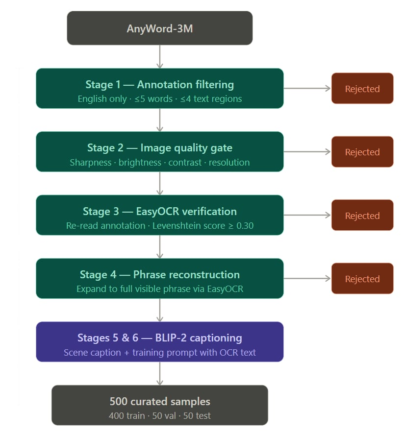
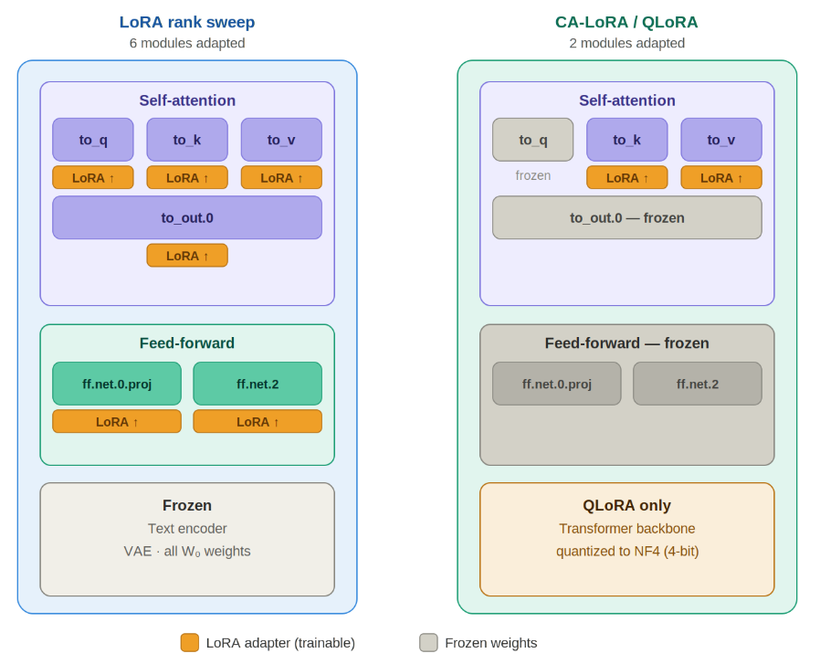

# Projet-IA-Efficient-Image-Generation

Welcome to the **Projet-IA-Efficient-Image-Generation** repository. This project provides a complete, end-to-end pipeline designed for creating high-quality OCR datasets, efficiently fine-tuning the FLUX.2 Klein 4B model, and running resource-constrained inference and benchmarking.

This repository is divided into three main modules, each contained within its respective folder.

---

## Repository Structure

* [**`Dataset_creation/`**](#1-dataset-creation) — Automated text-in-image dataset generation and filtering pipeline using EasyOCR and BLIP-2.
* [**`Efficient training/`**](#2-efficient-training) — Scripts and configurations for fine-tuning the FLUX.2 Klein 4B model.
* [**`Efficient inference/`**](#3-efficient-inference) — Tools for benchmarking, quantization, smart offloading, and quality evaluation of FLUX.2 variants.

---

## 1. Dataset Creation (`Dataset_creation/`)

  

This module houses our automated pipeline for building text-in-image datasets suitable for training text-to-image generative models (e.g., Stable Diffusion, ControlNet, FLUX). 

It streams images from HuggingFace's **AnyWord-3M** and applies a rigorous multi-step filtering and captioning process:
1.  **Annotation Filtering**: Keeps only valid, short, English text regions.
2.  **Quality Gating**: Filters by resolution, sharpness, brightness, and contrast.
3.  **OCR Verification (EasyOCR)**: Confirms text readability and reconstructs the full visible phrase.
4.  **Captioning (BLIP-2)**: Generates a visual description and creates a training prompt that embeds the verbatim OCR text.

**Key Features:**
* Outputs structured JSON records containing verified text, visual captions, and training prompts.
* Automatically splits data into Train (80%), Val (10%), and Test (10%).
* Supports local runs or SLURM cluster deployment.

### Dataset Examples
*Below are examples of the dataset outputs after passing through the filtering and captioning pipeline:*

  

> **Hardware Note:** BLIP-2 (`Salesforce/blip2-flan-t5-xl`) requires ~16 GB VRAM. The script auto-falls back to a lighter model if memory is insufficient. See the folder's README for detailed usage and threshold configurations.

---

## 2. Efficient Training (`Efficient training/`)

This directory contains the necessary project structure, dependencies, and configurations to efficiently fine-tune the **FLUX.2 Klein 4B** model using the datasets generated in the previous step.

  
   
  <em>LoRA architecture variants. Left (LoRA rank sweep): adapters applied to 6 modules spanning attention and feed-forward blocks. Right (CA-LoRA / QLoRA): adapters restricted to the 2 cross-attention key/value projections; the backbone is additionally quantized to 4-bit NF4 for QLoRA.</em>

**Key Features:**
* **Training Configurations**: Pre-built configs tailored for the FLUX.2 Klein 4B architecture.
* **Dependency Management**: Streamlined installation steps to ensure correct library versions for distributed training.
* **Project Structure**: Organized directories for checkpoints, logs, and customized training scripts.

*Please refer to the `README.md` inside the `Efficient training/` folder for specific installation commands and training launch instructions.*

---

## 3. Efficient Inference (`Efficient inference/`)

Running high-fidelity generative models often requires massive compute. This module is dedicated to benchmarking and running FLUX.2 variants under strict hardware constraints.

**Key Features:**
* **Smart Offloading**: Scripts to dynamically manage VRAM/RAM boundaries during generation.
* **Quantization**: Tools to reduce model precision for lighter memory footprints without aggressively sacrificing quality.
* **Hardware Monitoring**: Built-in utilities to track resource usage during inference.
* **Evaluation & OCR Quality**: Automated scripts to evaluate the generated images for overall visual quality and text rendering accuracy (OCR metrics).

### Visual Evaluation

<strong> Click to view Generation Comparison Grid</strong>

 
This grid provides a qualitative comparison of generation outputs across different configurations:

*Check the `README.md` inside the `Efficient inference/` folder for benchmarking commands and evaluation protocols.*

---

## Getting Started

To get started, we recommend tackling the pipeline in order:

1.  **Generate your data**: Navigate to `Dataset_creation/`, install the requirements, and run the pipeline to build your OCR text-in-image dataset.
2.  **Train your model**: Move to `Efficient training/`, set up your environment, point the training script to your newly generated dataset, and begin fine-tuning.
3.  **Test and Evaluate**: Finally, use the tools in `Efficient inference/` to run your fine-tuned model, measure hardware metrics, and evaluate text-rendering accuracy.

## License

This pipeline is provided for research purposes. Datasets (like AnyWord-3M) and base models (BLIP-2, FLUX.2) utilized across these modules are subject to their respective licenses on HuggingFace and original creator repositories.